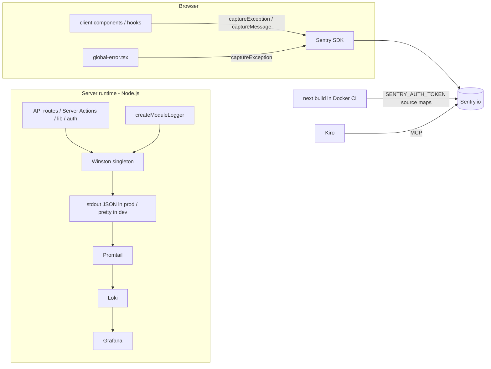
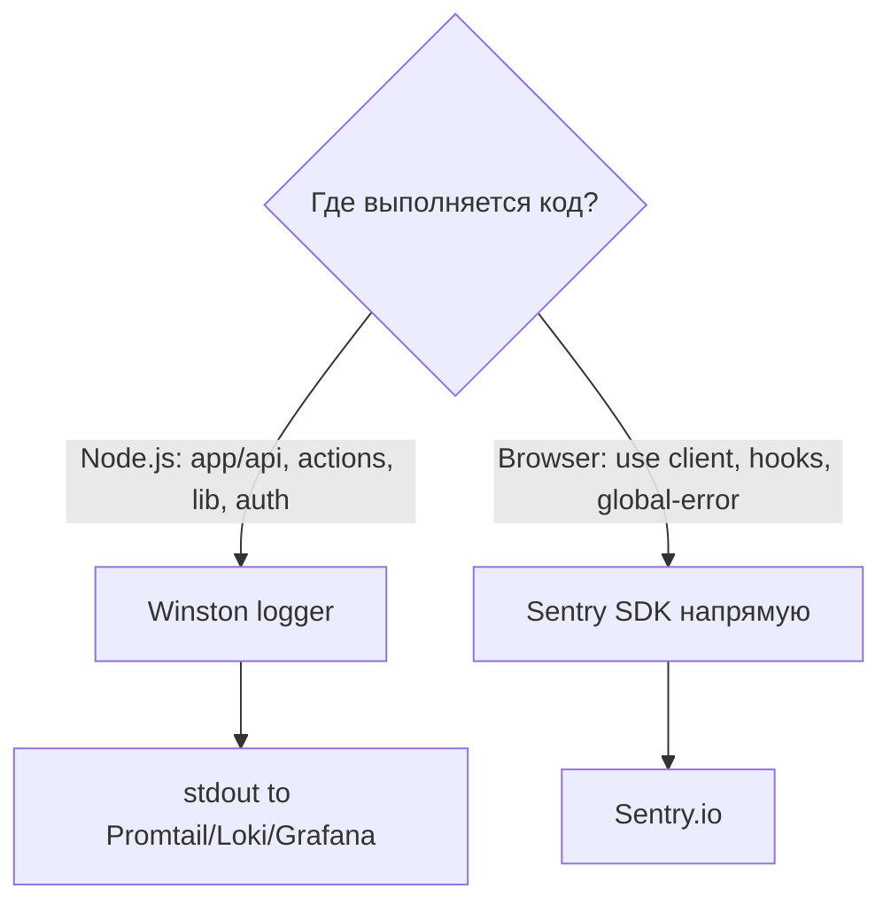
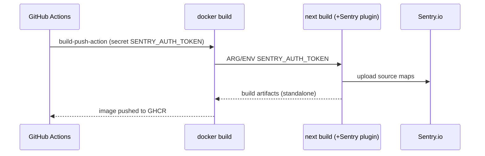

# Design — Логирование: Winston (сервер) + Sentry (клиент)

## Обзор

Наблюдаемость разделяется по среде выполнения. Серверный код (Node.js runtime) пишет
структурированные логи через Winston в stdout; клиентский код (браузер) отправляет
ошибки и диагностику в Sentry напрямую через `@sentry/nextjs`. Winston несовместим с
браузером/edge, поэтому он строго server-only. Отдельный фасад над `console` на клиенте
не вводится — компоненты и хуки используют Sentry SDK напрямую.

Дополнительно достраивается конфигурация Sentry (`withSentryConfig`, DSN через env,
sample rate по окружению), CI получает выгрузку source maps при сборке Docker-образа, и
добавляется MCP-конфигурация Sentry для Kiro.

## Архитектура



### Разделение сред выполнения



## Компоненты и интерфейсы

### 1. Серверный логгер — `src/lib/logger.ts`

Singleton по образцу `src/lib/db-prisma.ts`. Тестируемая фабрика `createLogger(options)`
позволяет инжектить окружение в unit-тестах.

```typescript
import type { Logger } from 'winston';

interface CreateLoggerOptions {
    env?: string;   // по умолчанию process.env.NODE_ENV
    level?: string; // по умолчанию LOG_LEVEL ?? (isProd ? 'info' : 'debug')
}

// Тестируемая фабрика (без побочного эффекта singleton)
export function createLogger(options?: CreateLoggerOptions): Logger;

// Singleton-доступ
export function getLogger(): Logger;
export const logger: Logger;

// Child-логгер с полем module
export function createModuleLogger(module: string): Logger;
```

**Формат по окружению:**

- development: `format.combine(colorize(), timestamp(), printf(...))` — читаемо, с цветом.
- production: `format.combine(timestamp(), json())` — машиночитаемый JSON для Loki.

**Уровень:** `process.env.LOG_LEVEL ?? (isProd ? 'info' : 'debug')`.

**defaultMeta:** `{ service: 'vocal-school', env }`.

**Транспорт:** только `transports.Console` (stdout). Файловых транспортов нет.

**Совместимость сборки:** `winston` добавляется в `serverExternalPackages` в
`next.config.ts`, чтобы Turbopack/трейсинг standalone не ломали динамические `require`
внутри Winston.

### 2. Модульный логгер

`createModuleLogger(module)` возвращает `logger.child({ module })`. Заменяет строковые
префиксы:

| Было (console)                     | Стало (module logger)                          |
|------------------------------------|------------------------------------------------|
| `console.log('[Alfa CRM] ...')`    | `createModuleLogger('alfa-crm').info('...')`   |
| `console.error('[Contest] ...', e)`| `log.error('...', { err: e })` (`module:'contest'`) |

### 3. Клиентская телеметрия — прямое использование Sentry

Отдельный фасад-логгер (`client-logger.ts`) не создаётся. Клиентские компоненты и хуки
импортируют `@sentry/nextjs` и вызывают его API напрямую:

- Ошибки (было `console.error`): `Sentry.captureException(error, { extra })`.
- Информационные/предупреждающие сообщения без объекта ошибки:
  `Sentry.captureMessage(message, 'info' | 'warning')` либо хлебные крошки
  `Sentry.addBreadcrumb(...)` для контекста.
- В development допускается оставить `console.*` для локальной отладки там, где это уже
  осмысленно; отправка в Sentry — основной канал наблюдаемости.

```typescript
import * as Sentry from '@sentry/nextjs';

// Было: console.error('Ошибка при отправке:', error)
Sentry.captureException(error, { extra: { context: 'quiz-submit' } });
```

Инициализация SDK уже выполнена визардом (`instrumentation-client.ts`), поэтому
дополнительной обёртки на клиенте не требуется.

### 4. Конфигурация Sentry

- `next.config.ts` оборачивается `withSentryConfig(nextConfig, { org, project, silent: !process.env.CI, widenClientFileUpload: true, disableLogger: true })`.
- DSN выносится в `NEXT_PUBLIC_SENTRY_DSN` с fallback на текущее значение — в
  `instrumentation-client.ts`, `sentry.server.config.ts`, `sentry.edge.config.ts`.
- `tracesSampleRate`: `1.0` в dev, `0.1` в prod.
- `.env.sentry-build-plugin` — в `.gitignore`; токен не коммитится.

Обёртка `withSentryConfig` должна сохранить существующие поля `nextConfig`
(`output: 'standalone'`, `serverExternalPackages`, `images`, `headers`, `experimental`,
`turbopack`).

### 5. CI — выгрузка source maps



- `Dockerfile`: `ARG SENTRY_AUTH_TOKEN` + `ENV SENTRY_AUTH_TOKEN=$SENTRY_AUTH_TOKEN` до
  `next build`.
- `deploy.yml`: пробросить `SENTRY_AUTH_TOKEN` из `secrets` в `docker/build-push-action`
  (`build-args` или `secrets`).
- Опционально: job `verify` (lint/type-check/test) перед `build-and-push`.
- Секрет `SENTRY_AUTH_TOKEN` заводится в GitHub Actions secrets (документируется).

### 6. MCP-конфигурация Sentry для Kiro

`.kiro/settings/mcp.json` с записью Sentry MCP-сервера (hosted
`https://mcp.sentry.dev/mcp` через remote-обёртку, либо stdio-вариант в зависимости от
актуальной документации). Секреты — через env. Синтаксис сверяется с доками Sentry MCP
на этапе реализации.

## Модель данных / формат логов

**Пример записи (production, JSON):**

```json
{
  "level": "info",
  "message": "Contestant created",
  "timestamp": "2026-09-12T10:00:00.000Z",
  "service": "vocal-school",
  "env": "production",
  "module": "contest",
  "id": 42
}
```

**Пример (development, pretty):**

```
2026-09-12 13:00:00 info [contest]: Contestant created { id: 42 }
```

## Обработка ошибок

- Серверные ошибки: `logger.error(message, { err })`; объект ошибки в метаданных, чтобы
  Winston сериализовал стек.
- Server Actions: логируют ошибку, но возвращают `ActionResult<T>` (без throw).
- API routes: логируют ошибку, но HTTP-статусы/тела ответов не меняются.
- Клиент: ошибки отправляются напрямую через `Sentry.captureException(error, { extra })`;
  `global-error.tsx` → `Sentry.captureException(error)`.
- next-auth: `CredentialsSignin` подавляется; остальное → Winston (`module: 'auth'`).

## Стратегия тестирования

- `src/lib/logger.test.ts` (Vitest):
  - уровень выбирается по env (`LOG_LEVEL`, prod/dev дефолты);
  - в prod формат — JSON с полями `timestamp`, `level`, `message`, `service`, `env`
    (проверка через in-memory/stream транспорт);
  - `createModuleLogger` добавляет поле `module`.
- Клиентская часть: отдельного модуля-логгера нет, поэтому unit-тесты фасада не
  требуются. При необходимости — точечная проверка, что `global-error.tsx` вызывает
  `Sentry.captureException` (мок `@sentry/nextjs`).
- Регрессия существующих тестов: `google-people.test.ts`, `oauth-sync.test.ts`,
  `db-prisma.test.ts`.
- Интеграция next-auth: проверка подавления `CredentialsSignin`.
- Финальные проверки: `npm run lint`, `type-check`, `test`, `build`.

## Ограничения и безопасность

- Winston — только серверный runtime; клиент/edge его не используют.
- Секреты (`SENTRY_AUTH_TOKEN`, DSN при необходимости) — только через env/CI secrets.
- Изменения CI/Dockerfile сохраняют текущий деплой-флоу (GHCR → VPS по SSH).
- Перед реализацией сверяются актуальные API Next.js 16 (`node_modules/next/dist/docs/`)
  и `@sentry/nextjs`, а также синтаксис Sentry MCP.
