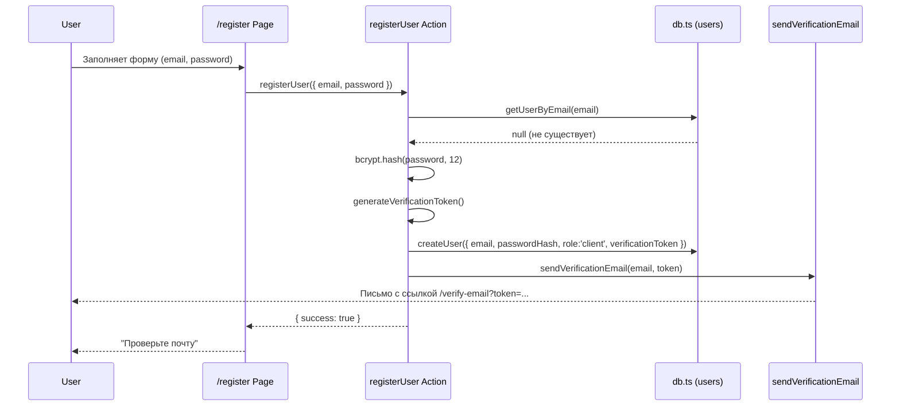
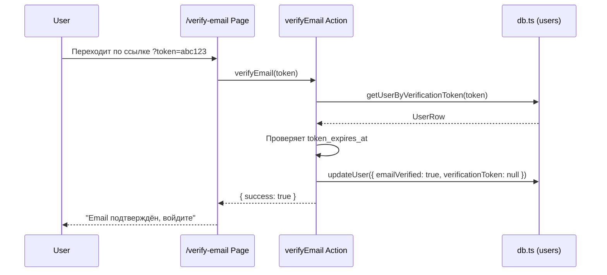
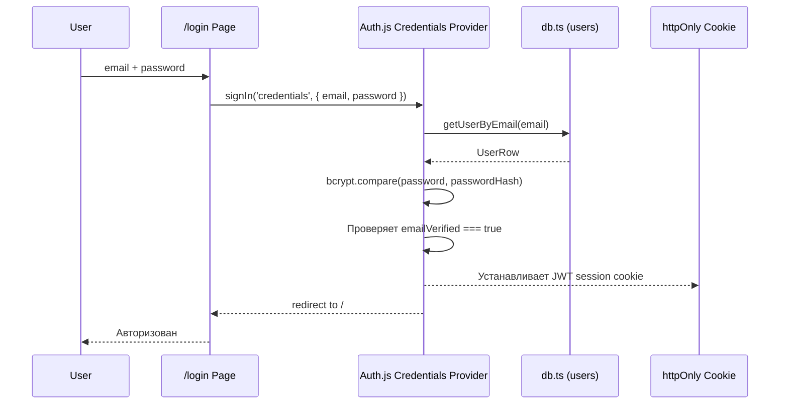
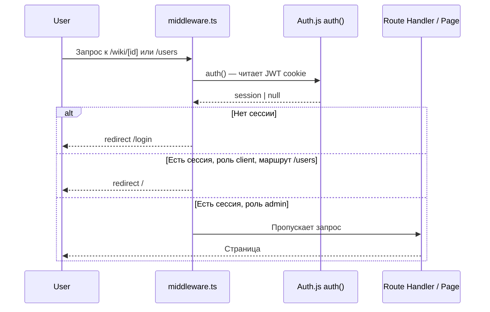

# Design Document: User Authentication

## Overview

Полноценная система аутентификации и авторизации для вокальной школы ЗВУЧИ на базе Auth.js v5 (NextAuth) с Credentials provider. Заменяет текущий хардкод-логин на полноценную БД-ориентированную систему с ролями `admin` и `client`, публичной регистрацией с подтверждением email и страницей управления пользователями.

Система использует JWT-сессии в httpOnly cookie, bcrypt-хэширование паролей и интегрируется с существующей SQLite БД (`data/wiki.db`) и nodemailer-инфраструктурой.

## Architecture

```mermaid
graph TD
    subgraph Client
        A[Login Page /login]
        B[Register Page /register]
        C[Admin /users Page]
        D[Protected Pages]
    end

    subgraph Auth Layer
        E[Auth.js v5 Handler\n/api/auth/[...nextauth]]
        F[Credentials Provider]
        G[JWT Session\nhttpOnly Cookie]
    end

    subgraph Application Layer
        H[auth() helper\nsrc/auth.ts]
        I[Middleware\nmiddleware.ts]
        J[Server Actions]
    end

    subgraph Data Layer
        K[src/lib/db.ts\nUser functions]
        L[SQLite\ndata/wiki.db\ntable: users]
    end

    subgraph Email Layer
        M[sendVerificationEmail\nsrc/app/actions/sendEmail.ts]
        N[SMTP / nodemailer]
    end

    A -->|credentials| F
    B -->|register action| J
    F -->|findUserByEmail + verifyPassword| K
    K --> L
    J -->|createUser + sendVerification| K
    J --> M
    M --> N
    E --> G
    G --> H
    H --> I
    I -->|protect routes| D
    I -->|admin-only| C
```

## Sequence Diagrams

### Регистрация пользователя



### Подтверждение email



### Логин



### Защита маршрутов (Middleware)



## Components and Interfaces

### Component 1: Auth.js Configuration (`src/auth.ts`)

**Purpose**: Центральная конфигурация Auth.js v5 — провайдер, callbacks, типы сессии.

**Interface**:
```typescript
// src/auth.ts
import NextAuth from 'next-auth'
import Credentials from 'next-auth/providers/credentials'

export const { handlers, auth, signIn, signOut } = NextAuth({
  providers: [Credentials({ ... })],
  callbacks: {
    jwt({ token, user }) { ... },
    session({ session, token }) { ... },
  },
  session: { strategy: 'jwt' },
  pages: {
    signIn: '/login',
    error: '/login',
  },
})
```

**Responsibilities**:
- Определяет Credentials provider с валидацией email/password
- Расширяет JWT-токен полями `id`, `role`
- Расширяет объект `session.user` полями `id`, `role`
- Экспортирует `auth()` для использования в Server Components и middleware

---

### Component 2: Middleware (`middleware.ts`)

**Purpose**: Защита маршрутов на уровне Edge Runtime.

**Interface**:
```typescript
// middleware.ts
export { auth as middleware } from '@/auth'

export const config = {
  matcher: [
    '/wiki/:path*/edit',
    '/users/:path*',
    '/api/v1/:path*',
  ],
}
```

**Responsibilities**:
- Перехватывает запросы к защищённым маршрутам
- Перенаправляет неаутентифицированных пользователей на `/login`
- Перенаправляет `client`-пользователей при попытке доступа к admin-маршрутам

---

### Component 3: User DB Functions (`src/lib/db.ts` — расширение)

**Purpose**: CRUD-операции для таблицы `users`.

**Interface**:
```typescript
interface UserRow {
  id: number
  email: string
  password_hash: string
  role: 'admin' | 'client'
  email_verified: 0 | 1
  verification_token: string | null
  token_expires_at: string | null
  created_at: string
}

function getUserByEmail(email: string): UserRow | undefined
function getUserById(id: number): UserRow | undefined
function createUser(data: CreateUserInput): UserRow
function updateUser(id: number, data: Partial<UserRow>): void
function deleteUser(id: number): void
function getAllUsers(): UserRow[]
function getUserByVerificationToken(token: string): UserRow | undefined
```

**Responsibilities**:
- Инициализация таблицы `users` при старте БД (миграция)
- Seed первого admin-пользователя из env-переменных
- Все запросы через prepared statements (защита от SQL-инъекций)

---

### Component 4: Server Actions (`src/app/actions/auth.ts`)

**Purpose**: Серверные действия для регистрации, подтверждения email, смены пароля.

**Interface**:
```typescript
async function registerUser(data: {
  email: string
  password: string
}): Promise<{ success: boolean; error?: string }>

async function verifyEmail(token: string): Promise<{ success: boolean; error?: string }>

async function resendVerification(email: string): Promise<{ success: boolean; error?: string }>
```

**Responsibilities**:
- Валидация входных данных (формат email, длина пароля ≥ 8 символов)
- Проверка уникальности email
- bcrypt-хэширование пароля (rounds = 12)
- Генерация криптографически стойкого токена подтверждения (crypto.randomBytes)
- Вызов `sendVerificationEmail`
- Обновление статуса `email_verified` при подтверждении

---

### Component 5: Email Action (`src/app/actions/sendEmail.ts` — расширение)

**Purpose**: Отправка письма подтверждения email через существующий nodemailer transporter.

**Interface**:
```typescript
async function sendVerificationEmail(
  email: string,
  token: string
): Promise<void>
```

**Responsibilities**:
- Формирует ссылку `https://zvuchi-vocal.ru/verify-email?token={token}`
- Использует существующий `transporter` из `sendEmail.ts`
- HTML-шаблон в стиле существующих писем (цвет #ab1515)

---

### Component 6: Login Page (`src/app/login/page.tsx` — обновление)

**Purpose**: Существующая страница логина — адаптируется под Auth.js v5.

**Текущее состояние**: Форма с полями `login` (текст) и `password`, вызывает `/api/auth/login` напрямую.

**Изменения**:
- Поле `login` переименовать в `email` (тип `email`)
- Вызов `fetch('/api/auth/login')` заменить на `signIn('credentials', { email, password })` из Auth.js
- Добавить ссылку на `/register` для новых пользователей
- Сохранить существующие стили (bg-zinc-950, bg-zinc-900, purple-600)

**Responsibilities**:
- Форма входа по email + пароль
- Отображение ошибок Auth.js (неверные данные, неподтверждённый email)
- Редирект после успешного входа

---

### Component 7: Logout Page (`src/app/logout/page.tsx` — обновление)

**Purpose**: Существующая страница логаута — адаптируется под Auth.js v5.

**Текущее состояние**: Вызывает `fetch('/api/auth/logout')` напрямую.

**Изменения**:
- Заменить `fetch('/api/auth/logout')` на `signOut()` из Auth.js

---

### Component 8: Users Admin Page (`src/app/users/page.tsx`)

**Purpose**: Страница управления пользователями (только для admin).

**Interface**:
```typescript
// Server Component
export default async function UsersPage() {
  const session = await auth()
  // redirect if not admin
  const users = getAllUsers()
  return <UsersList users={users} />
}
```

**Responsibilities**:
- Серверная проверка роли (дополнительно к middleware)
- Отображение таблицы пользователей: email, роль, статус верификации, дата регистрации
- Кнопка удаления пользователя (Server Action `deleteUserAction`)
- Запрет удаления самого себя

## Data Models

### Model 1: UserRow (таблица `users`)

```typescript
interface UserRow {
  id: number                        // INTEGER PRIMARY KEY AUTOINCREMENT
  email: string                     // TEXT NOT NULL UNIQUE
  password_hash: string             // TEXT NOT NULL (bcrypt, rounds=12)
  role: 'admin' | 'client'         // TEXT NOT NULL DEFAULT 'client'
  email_verified: 0 | 1            // INTEGER NOT NULL DEFAULT 0
  verification_token: string | null // TEXT (crypto.randomBytes(32).toString('hex'))
  token_expires_at: string | null   // TEXT (ISO datetime, +24h от создания)
  created_at: string                // TEXT NOT NULL DEFAULT (datetime('now'))
}
```

**SQL DDL**:
```sql
CREATE TABLE IF NOT EXISTS users (
  id                 INTEGER PRIMARY KEY AUTOINCREMENT,
  email              TEXT    NOT NULL UNIQUE,
  password_hash      TEXT    NOT NULL,
  role               TEXT    NOT NULL DEFAULT 'client',
  email_verified     INTEGER NOT NULL DEFAULT 0,
  verification_token TEXT,
  token_expires_at   TEXT,
  created_at         TEXT    NOT NULL DEFAULT (datetime('now'))
);
```

**Validation Rules**:
- `email`: валидный формат RFC 5321, уникальный в БД
- `password_hash`: bcrypt hash, никогда не передаётся клиенту
- `role`: строго `'admin'` или `'client'`
- `token_expires_at`: токен действителен 24 часа с момента создания

---

### Model 2: Session (Auth.js JWT)

```typescript
// Расширение типов Auth.js
declare module 'next-auth' {
  interface Session {
    user: {
      id: string
      email: string
      role: 'admin' | 'client'
    }
  }
  interface User {
    id: string
    email: string
    role: 'admin' | 'client'
  }
}

declare module 'next-auth/jwt' {
  interface JWT {
    id: string
    role: 'admin' | 'client'
  }
}
```

**Validation Rules**:
- JWT хранится только в httpOnly cookie (`__Secure-authjs.session-token` в prod)
- Не передаётся в localStorage или sessionStorage
- Срок действия: 7 дней (настраивается через `maxAge`)

---

### Model 3: RegisterFormData

```typescript
interface RegisterFormData {
  email: string     // required, valid email format
  password: string  // required, min 8 chars
  confirmPassword: string // must match password
}
```

---

### Model 4: LoginFormData

```typescript
interface LoginFormData {
  email: string    // required
  password: string // required
}
```

## Error Handling

### Error Scenario 1: Неверные учётные данные при логине

**Condition**: Email не найден в БД или пароль не совпадает с bcrypt-хэшем  
**Response**: Auth.js возвращает `CredentialsSignin` error; страница `/login` показывает «Неверный email или пароль»  
**Recovery**: Пользователь повторяет попытку; нет блокировки аккаунта в v1

### Error Scenario 2: Email не подтверждён при логине

**Condition**: `email_verified = 0` в момент попытки входа  
**Response**: Credentials provider выбрасывает кастомный `AuthError`; страница показывает «Подтвердите email. Письмо отправлено на {email}»  
**Recovery**: Пользователь переходит по ссылке из письма или запрашивает повторную отправку

### Error Scenario 3: Email уже зарегистрирован

**Condition**: `getUserByEmail(email)` возвращает существующего пользователя  
**Response**: `registerUser` возвращает `{ error: 'Этот email уже зарегистрирован' }`  
**Recovery**: Пользователь использует форму логина или восстановления пароля

### Error Scenario 4: Токен подтверждения истёк или не найден

**Condition**: `token_expires_at < now()` или токен не найден в БД  
**Response**: `verifyEmail` возвращает `{ error: 'Ссылка недействительна или устарела' }`  
**Recovery**: Пользователь запрашивает повторную отправку через `/resend-verification`

### Error Scenario 5: Попытка доступа к admin-маршруту с ролью client

**Condition**: Middleware обнаруживает `session.user.role !== 'admin'` для маршрутов `/users/*`  
**Response**: `redirect('/')` — перенаправление на главную без сообщения об ошибке  
**Recovery**: N/A — пользователь не должен знать о существовании admin-страниц

### Error Scenario 6: Попытка удалить самого себя на странице /users

**Condition**: `deleteUserAction` вызван с `id === session.user.id`  
**Response**: Server Action возвращает `{ error: 'Нельзя удалить собственный аккаунт' }`  
**Recovery**: Кнопка удаления для текущего пользователя отключена на UI-уровне

## Correctness Properties

*A property is a characteristic or behavior that should hold true across all valid executions of a system — essentially, a formal statement about what the system should do. Properties serve as the bridge between human-readable specifications and machine-verifiable correctness guarantees.*

### Property 1: Password hashing round-trip

*For any* valid password string, hashing it with bcrypt (cost factor 12) and then comparing the original password to the resulting hash using `bcrypt.compare` SHALL return `true`; and the hash SHALL NOT equal the original plaintext password.

**Validates: Requirements 1.3, 2.2, 10.1, 10.2**

---

### Property 2: Email uniqueness enforcement

*For any* email address that already exists in the `users` table, attempting to create a second user with the same email SHALL fail and return the error `'Этот email уже зарегистрирован'`, leaving the original record unchanged.

**Validates: Requirements 1.4, 2.5**

---

### Property 3: New user default field values

*For any* valid registration input (valid email, password ≥ 8 chars), the created user record SHALL have `role = 'client'` and `email_verified = 0`.

**Validates: Requirements 1.5, 2.1**

---

### Property 4: Verification token format and uniqueness

*For any* two distinct user registrations, the generated `verification_token` values SHALL each be exactly 64 hexadecimal characters (32 bytes) and SHALL NOT be equal to each other.

**Validates: Requirements 2.3, 10.3**

---

### Property 5: Email format validation rejects invalid inputs

*For any* string that does not conform to a valid email format (e.g., missing `@`, missing domain), the `registerUser` action SHALL return a validation error and SHALL NOT create a user record.

**Validates: Requirements 2.6**

---

### Property 6: Password length validation

*For any* string of length less than 8 characters submitted as a password, the `registerUser` action SHALL return a validation error and SHALL NOT create a user record.

**Validates: Requirements 2.7**

---

### Property 7: Email verification state transition

*For any* user with a valid, non-expired `verification_token`, calling `verifyEmail(token)` SHALL set `email_verified = 1`, set `verification_token = null`, and set `token_expires_at = null` for that user — and the token SHALL NOT be usable a second time.

**Validates: Requirements 3.1, 3.5, 10.6**

---

### Property 8: Invalid and expired token rejection

*For any* token string that either does not exist in the `users` table or has a `token_expires_at` value in the past, calling `verifyEmail(token)` SHALL return `{ error: 'Ссылка недействительна или устарела' }` and SHALL NOT modify any user record.

**Validates: Requirements 3.2, 3.3**

---

### Property 9: Resend verification updates token and expiry

*For any* user with `email_verified = 0`, calling `resendVerification(email)` SHALL generate a new `verification_token` (different from the previous one), set `token_expires_at` to 24 hours from the current time, and trigger a new verification email.

**Validates: Requirements 4.1**

---

### Property 10: Resend verification rejected for already-verified users

*For any* user with `email_verified = 1`, calling `resendVerification(email)` SHALL return an error and SHALL NOT modify the user record or send an email.

**Validates: Requirements 4.3**

---

### Property 11: Login rejects unverified users

*For any* user with `email_verified = 0`, submitting correct credentials (matching email and password) to the Credentials_Provider SHALL be rejected and SHALL NOT establish a session.

**Validates: Requirements 5.4**

---

### Property 12: Login rejects incorrect credentials

*For any* login attempt where either the email does not exist in the DB or the submitted password does not match the stored bcrypt hash, the Auth_System SHALL return the error `'Неверный email или пароль'` and SHALL NOT establish a session.

**Validates: Requirements 5.2, 5.3**

---

### Property 13: Session contains required user fields without sensitive data

*For any* successfully authenticated user, the resulting `session.user` object SHALL contain `id`, `email`, and `role` fields matching the user's DB record, and SHALL NOT contain `password_hash` or any other sensitive credential field.

**Validates: Requirements 5.5, 9.1, 9.2, 10.4**

---

### Property 14: Login-logout round-trip clears session

*For any* authenticated session, performing a logout SHALL result in the session being cleared such that a subsequent call to `auth()` returns `null`.

**Validates: Requirements 6.1, 6.2**

---

### Property 15: Middleware blocks unauthenticated requests to protected routes

*For any* request to a protected route (`/wiki/:path*/edit`, `/users/:path*`, `/api/v1/:path*`) without a valid session, the Middleware SHALL redirect the request to `/login`.

**Validates: Requirements 7.1**

---

### Property 16: Middleware blocks client-role users from admin routes

*For any* session with `role = 'client'` and any request to an admin-only route (`/users/:path*`), the Middleware SHALL redirect the request to `/`.

**Validates: Requirements 7.2**

---

### Property 17: Middleware allows admin through all protected routes

*For any* session with `role = 'admin'` and any request to any protected route, the Middleware SHALL allow the request to proceed without redirection.

**Validates: Requirements 7.3**

---

### Property 18: Middleware allows client through non-admin protected routes

*For any* session with `role = 'client'` and any request to a non-admin protected route (e.g., `/wiki/:path*/edit`, `/api/v1/:path*`), the Middleware SHALL allow the request to proceed without redirection.

**Validates: Requirements 7.4**

---

### Property 19: User deletion removes record from DB

*For any* user record in the DB where `id ≠ current_admin_id`, calling `deleteUserAction(id)` SHALL remove the record from the `users` table such that a subsequent `getUserById(id)` returns `undefined`.

**Validates: Requirements 8.2**

---

### Property 20: Self-deletion is always rejected

*For any* admin user, calling `deleteUserAction` with their own `id` SHALL return `{ error: 'Нельзя удалить собственный аккаунт' }` and SHALL NOT remove the record from the `users` table.

**Validates: Requirements 8.3**

---

### Property 21: Password confirmation mismatch is rejected client-side

*For any* pair of strings where `password ≠ confirmPassword`, the registration form SHALL display a validation error and SHALL NOT submit the form to the server.

**Validates: Requirements 12.2**

---

## Testing Strategy

### Unit Testing Approach

Тестировать изолированные функции с помощью Vitest (уже настроен в проекте):

- `getUserByEmail`, `createUser`, `deleteUser` — с in-memory SQLite или моком
- `registerUser` action — мок `db.ts` и `sendVerificationEmail`
- `verifyEmail` action — проверка граничных случаев (истёкший токен, несуществующий токен)
- bcrypt-хэширование — проверка что хэш не равен исходному паролю

### Property-Based Testing Approach

**Property Test Library**: fast-check (установить как devDependency)

Ключевые свойства для проверки:
- Для любого валидного пароля: `bcrypt.compare(password, bcrypt.hash(password, 12)) === true`
- Для любых двух разных паролей: хэши не совпадают
- `getUserByEmail(email)` всегда возвращает пользователя с тем же email
- Токен верификации всегда уникален (проверка на коллизии при генерации)

### Integration Testing Approach

- Полный flow регистрации → подтверждения email → логина с тестовой БД
- Проверка что `auth_token` cookie устанавливается как httpOnly
- Проверка редиректов middleware для разных ролей

## Security Considerations

- **Пароли**: bcrypt с cost factor 12; никогда не логируются и не передаются клиенту
- **JWT**: хранится только в httpOnly, Secure, SameSite=Lax cookie; не доступен из JavaScript
- **Токен верификации**: `crypto.randomBytes(32)` — 256 бит энтропии; TTL 24 часа; одноразовый (обнуляется после использования)
- **SQL-инъекции**: все запросы через better-sqlite3 prepared statements
- **CSRF**: Auth.js v5 использует встроенную CSRF-защиту для form actions
- **Seed admin**: начальный admin создаётся из `ADMIN_EMAIL` + `ADMIN_PASSWORD` env-переменных при первом запуске; `ZVUCHI_PASSWORD` и `ADMIN_TOKEN` выводятся из использования
- **Rate limiting**: не входит в v1; рекомендуется добавить на уровне nginx/CDN

## Performance Considerations

- better-sqlite3 — синхронный, но очень быстрый; таблица `users` будет небольшой (< 1000 записей)
- Индекс на `users.email` (UNIQUE автоматически создаёт индекс)
- Индекс на `users.verification_token` для быстрого поиска при подтверждении
- JWT-сессии не требуют обращения к БД при каждом запросе — только при логине

## Dependencies

| Пакет | Версия | Назначение |
|-------|--------|-----------|
| `next-auth` | `^5.0.0` (beta) | Auth.js v5 — основная библиотека аутентификации |
| `bcryptjs` | `^2.4.3` | Хэширование паролей (pure JS, нет нативных зависимостей) |
| `@types/bcryptjs` | `^2.4.6` | TypeScript типы для bcryptjs |

Существующие зависимости, которые переиспользуются:
- `better-sqlite3` — БД
- `nodemailer` — отправка email
- `next` 15 App Router — маршрутизация и Server Actions

Файлы, которые заменяются/удаляются:
- `src/app/api/auth/login/route.ts` → заменяется Auth.js handler
- `src/app/api/auth/logout/route.ts` → заменяется `signOut()` из Auth.js
- `src/lib/auth.ts` (`checkAuth`/`checkApiAuth`) → заменяется `auth()` из Auth.js
